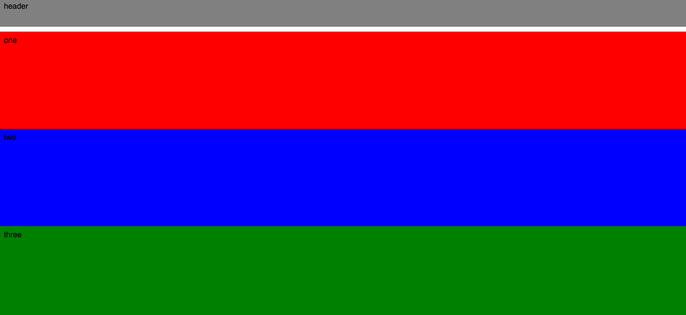
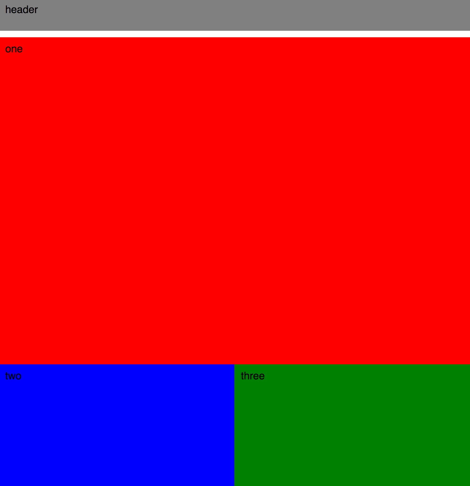
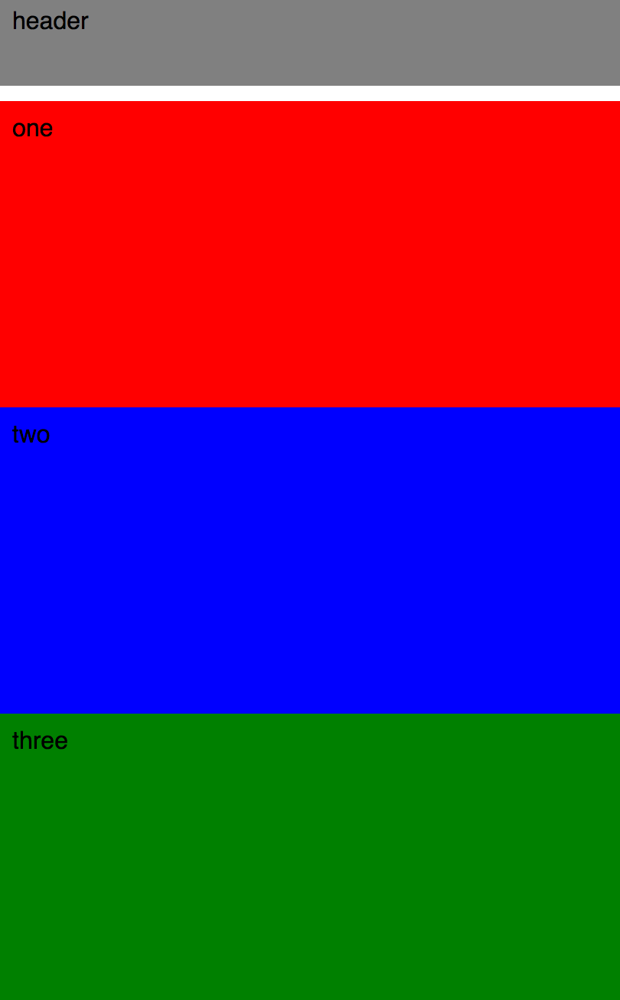
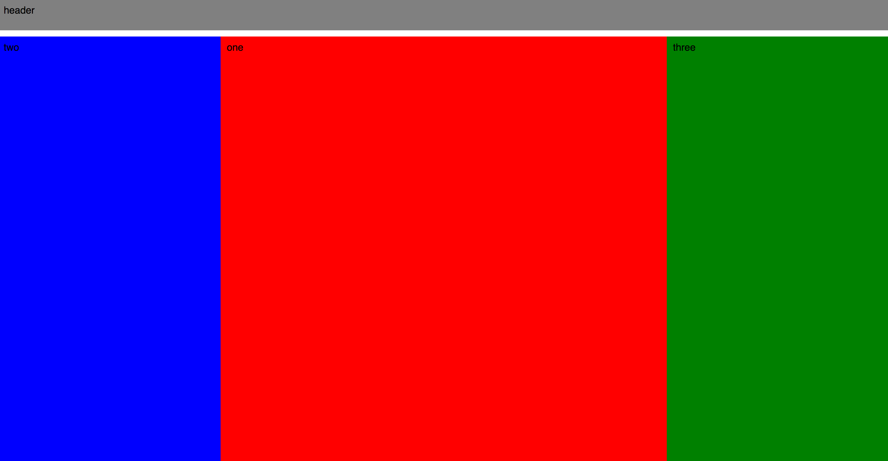

# CSS Responsive Assessment

## Getting Started

1. Fork and then clone
1. The page currently looks like this for all screen sizes:

  

## Update

Add one or more media queries to the *main.css* file to make the page responsive, making sure to add the appropriate meta tags to set the viewport correctly within the *index.html* file:

### Screen sizes greater than 800px

### Screen sizes greater than 420px

### Screen sizes less than 420px

## Success Criteria

- CSS Includes media queries with mobile-first breakpoints (min-width instead of max-width)
- Uses flex box / floats / percentage-based widths to show content flowing to a grid
- Includes meta tags to set the viewport correctly
